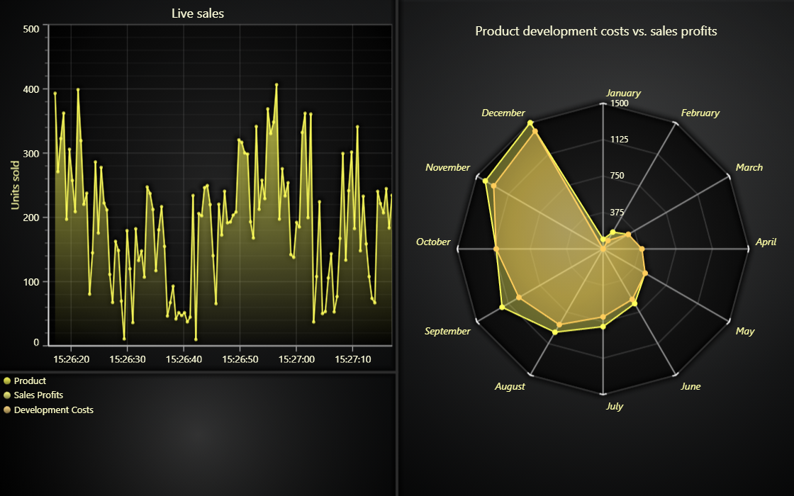

# JavaScript Dashboard With Legend



This demo application belongs to the set of examples for LightningChart JS, data visualization library for JavaScript.

LightningChart JS is entirely GPU accelerated and performance optimized charting library for presenting massive amounts of data. It offers an easy way of creating sophisticated and interactive charts and adding them to your website or web application.

The demo can be used as an example or a seed project. Local execution requires the following steps:

-   Make sure that relevant version of [Node.js](https://nodejs.org/en/download/) is installed
-   Open the project folder in a terminal:

          npm install              # fetches dependencies
          npm start                # builds an application and starts the development server

-   The application is available at _http://localhost:8080_ in your browser, webpack-dev-server provides hot reload functionality.


## Description

This example shows a simple dashboard with multiple chart types and LegendBox Panel.

The dashboard allows rendering of multiple scenes in a single view port highly efficiently with minimal memory resources. During the creation of a dashboard instance, the amount of rows and columns will have to be specified. This can not be changed afterwards.

**(!) Using `Dashboard` is no longer recommended for new applications. Find latest recommendations here: https://lightningchart.com/js-charts/docs/basic-topics/grouping-charts/**

```javascript
// Create a dashboard with three rows and two columns.
const dashboard = lightningChart().Dashboard({
    numberOfRows: 3,
    numberOfColumns: 2,
})
```

Charts and Panels can then be added to the dashboard like follows:

```javascript
// Create a ChartXY that occupies the top row of the dashboard.
const chartXY = dashboard.createChartXY({
    // Row index (starting from bottom).
    columnIndex: 2,
    // Column index (starting from left).
    rowIndex: 0,
    // Row span (height, basically).
    columnSpan: 1,
    // Column span (width, basically).
    rowSpan: 2,
})
```

[//]: # 'IMPORTANT: The assets will not show before README.md is built - relative path is different!'


Dashboards have separate methods for adding a different kind of Charts or Panels. Dashboard represents a grid with rows & columns. During the creation of the element, the row & column indices and the horizontal & vertical spans should be specified to position it in the correct place and fill the desired amount of cells.

```javascript
// Create a spider chart and attach to dashboard.
// Row 0, Column 0, Rows to fill 2, Columns to fill 1.
const spiderChart = dashboard.createSpider(0, 0, 2, 1)

// Create a Legend Panel and attach to dashboard.
// Row 0, Column 1, Rows to fill 2, Columns to fill 1.
const legendBox = dashboard.createLegendPanel({
    columnIndex: 0,
    rowIndex: 1,
    columnSpan: 2,
    rowSpan: 1,
})
```

The dashboard rows and columns can have varying heights and widths respectively - you can resize them by clicking and dragging on the grid line separating the columns and rows from each other, or by using methods to set them programmatically:

```javascript
// Set height of the first row of a dashboard.
// By default each row and column has a size of 1.
// The size is always relative to the combined size of each row / column.
dashboard.setRowHeight(0, 2)
// Set width of the first and the second column of a dashboard.
// First column width will be 2/5 of the entire view's width.
dashboard.setColumnWidth(0, 2)
// Second column width will be 3/5 of the entire view's width.
dashboard.setColumnWidth(1, 3)
```


## API Links

* [Dashboard]
* [Legend panel]
* [XY cartesian chart]
* [Spline series]
* [Scroll strategies]
* [Spider chart]
* [RGBA color factory]
* [UI position origins]


## Support

If you notice an error in the example code, please open an issue on [GitHub][0] repository of the entire example.

Official [API documentation][1] can be found on [LightningChart][2] website.

If the docs and other materials do not solve your problem as well as implementation help is needed, ask on [StackOverflow][3] (tagged lightningchart).

If you think you found a bug in the LightningChart JavaScript library, please contact sales@lightningchart.com.

Direct developer email support can be purchased through a [Support Plan][4] or by contacting sales@lightningchart.com.

[0]: https://github.com/Arction/
[1]: https://lightningchart.com/lightningchart-js-api-documentation/
[2]: https://lightningchart.com
[3]: https://stackoverflow.com/questions/tagged/lightningchart
[4]: https://lightningchart.com/support-services/

© LightningChart Ltd 2009-2022. All rights reserved.


[Dashboard]: https://lightningchart.com/js-charts/api-documentation/v8.0.0/classes/Dashboard.html
[Legend panel]: https://lightningchart.com/js-charts/api-documentation/v8.0.0/classes/LegendPanel.html
[XY cartesian chart]: https://lightningchart.com/js-charts/api-documentation/v8.0.0/classes/ChartXY.html
[Spline series]: https://lightningchart.com/js-charts/api-documentation/v8.0.0/classes/SplineSeries.html
[Scroll strategies]: https://lightningchart.com/js-charts/api-documentation/v8.0.0/variables/AxisScrollStrategies.html
[Spider chart]: https://lightningchart.com/js-charts/api-documentation/v8.0.0/classes/SpiderChart.html
[RGBA color factory]: https://lightningchart.com/js-charts/api-documentation/v8.0.0/functions/ColorRGBA.html
[UI position origins]: https://lightningchart.com/js-charts/api-documentation/v8.0.0/variables/UIOrigins.html

